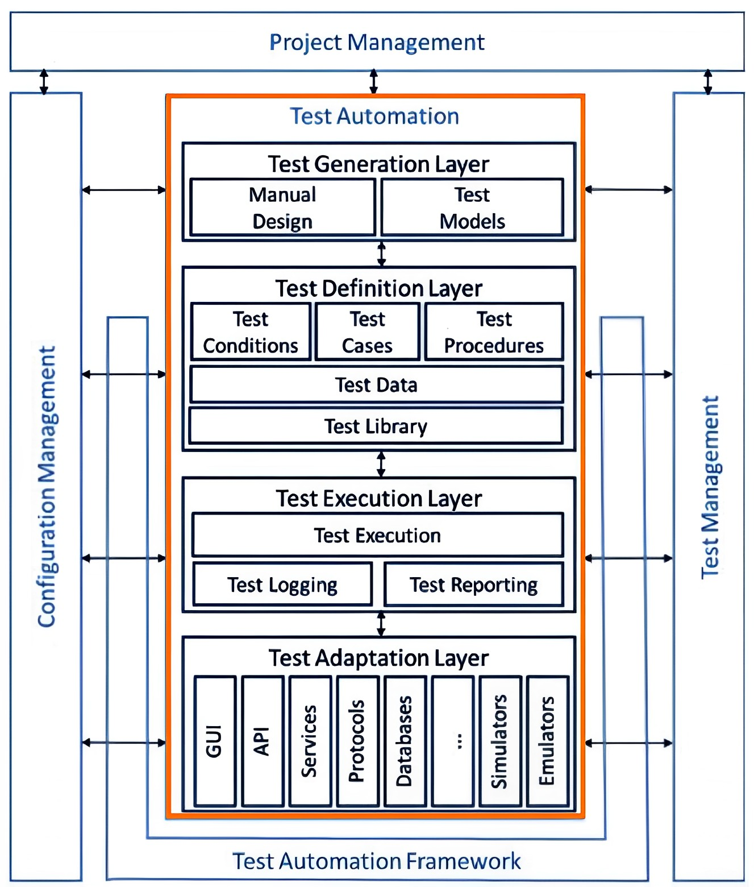
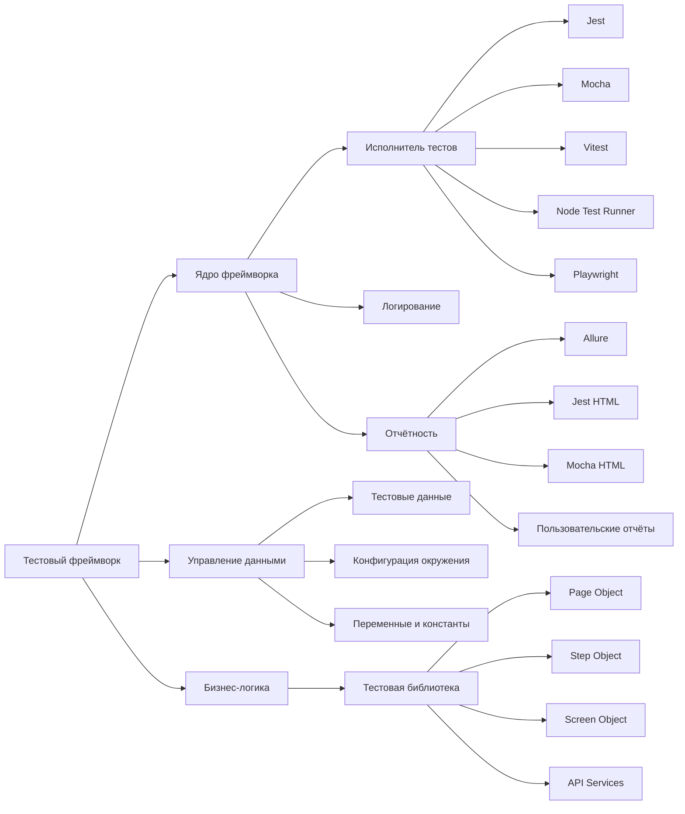

# Введение в автоматизацию тестирования

## Карта курса

* [Введение в автоматизацию тестирования](./introduction.md)
* [Тестирование API](./test-api.md)
* [Практики CI/CD](./ci1-github.md)
* [Тестирование UI](./test-ui.md)
* [Проектная работа](./project.md)

## Определение автоматизированного тестирования

Автоматизированное тестирование программного обеспечения — процесс тестирования, при котором основные функции и шаги теста (запуск, инициализация, выполнение, анализ и выдача результата) выполняются автоматически с помощью специализированных инструментов.

## Мифы и реальность автоматизации

### Распространённые заблуждения

Рассмотрим наиболее распространённые мифы об автоматизации тестирования:

**Миф 1: Автоматизация решит все проблемы выпуска качественного ПО**
- **Реальность**: Автоматизация не гарантирует качество продукта. Тесты могут давать ложные результаты и не всегда выявляют критические ошибки.

**Миф 2: Автоматизация позволит отказаться от ручного тестирования**
- **Реальность**: Ручное тестирование остаётся необходимым. Не все сценарии можно автоматизировать эффективно.

**Миф 3: Автоматизация необходима как модный тренд**
- **Реальность**: Автоматизация должна внедряться по технико-экономическим причинам, а не ради следования трендам.

### Реальные преимущества автоматизации

**Ускорение выпуска релизов**
- Автоматизированные регрессионные тесты выполняются значительно быстрее ручных проверок.

**Расширение покрытия тестирования**
- Возможность тестирования на различных платформах, операционных системах и браузерах одновременно.

## Когда автоматизация обязательна

Автоматизация тестирования становится необходимой при соблюдении следующих условий:

* Масштабное приложение с большим количеством бизнес-функций
* Значительный срок жизни приложения (от 1 года и более)
* Внедрение CI/CD процессов и регулярные релизы
* Ограниченное количество QA-специалистов

## Задачи автоматизации тестирования

Основные задачи, которые решает автоматизация:

* **Автоматизация рутинных проверок** — снижение нагрузки на ручных тестировщиков
* **Контроль основных функций** — отслеживание изменений в продукте
* **Кросс-платформенное тестирование** — проверка на различных устройствах и операционных системах
* **Тестирование производительности** — проверка работы приложения под нагрузкой

## Уровни тестирования

### Тестовая пирамида

Концепция тестовой пирамиды была предложена Мартином Фаулером. [Рекомендуем ознакомиться с оригинальной статьёй](https://martinfowler.com/bliki/TestPyramid.html).

Основные уровни тестирования:

* **Unit-тесты** — модульные тесты отдельных компонентов
* **Integration-тесты** — тесты взаимодействия между модулями
* **End-to-end тесты** — сквозные тесты пользовательских сценариев

### Принципы тестовой пирамиды

Согласно концепции Фаулера:
- Большинство тестов должны быть модульными (разрабатываются программистами)
- Меньшее количество интеграционных тестов
- Минимальное количество end-to-end тестов (создаются программистами и тестировщиками)

### Альтернативный подход: Testing Trophy

В статье ["Write tests. Not too many. Mostly integration"](https://kentcdodds.com/blog/write-tests) Кент С. Доддс предлагает альтернативный подход — "Testing Trophy".

Критерии выбора типов тестов:
- **Стоимость** — дешёвые или дорогие в разработке и поддержке
- **Скорость** — быстрые или медленные в выполнении
- **Уверенность** — низкий или высокий уровень доверия к результатам

## Обеспечение качества и контроль качества

### Различия между QA и QC

Термины "обеспечение качества" (QA — Quality Assurance) и "контроль качества" (QC — Quality Control) часто используются как взаимозаменяемые, однако между ними существуют важные различия.

### QC (Quality Control) — Контроль качества

**Определение**: Контроль качества — анализ результатов тестирования и качества новых версий выпускаемого продукта.

**Основные задачи контроля качества**:
* Проверка готовности программного обеспечения к релизу
* Проверка соответствия требований и качества проекта

### QA (Quality Assurance) — Обеспечение качества

**Определение**: Обеспечение качества — изучение возможностей по изменению и улучшению процесса разработки, улучшению коммуникаций в команде, где тестирование является только одним из аспектов обеспечения качества.

**Основные задачи обеспечения качества**:
* Проверка технических характеристик и требований к ПО
* Оценка рисков
* Планирование задач для улучшения качества продукции
* Подготовка документации, тестового окружения и данных
* Тестирование
* Анализ результатов тестирования и составление отчётов

## Оценка эффективности тестирования

### ROI автоматизации

ROI (Return on Investment) автоматизации — показатель возврата инвестиций в автоматизацию тестирования. Основные метрики:
* Снижение времени выполнения тестов
* Уменьшение количества ошибок в продакшене
* Экономия рабочего времени QA-специалистов

### Покрытие тестами

**Покрытие требований**
- Источник: требования к программе
- Принцип: ошибка в реализации требования проявляется при любой проверке этого требования

**Покрытие кода**
- Источник: исходный код программы
- Метод: тестирование "белого ящика" с использованием знания внутреннего устройства программы

## Архитектура тестового фреймворка

### Структура согласно ISTQB

Согласно стандарту ISTQB, тестовый фреймворк состоит из нескольких взаимосвязанных компонентов. Рассмотрим упрощённую схему архитектуры тестового фреймворка.

### Архитектура тестового фреймворка

### Компоненты тестового фреймворка

**Ядро фреймворка**
- **Исполнитель тестов** — управляет запуском и выполнением тестов
- **Логирование** — фиксирует события и ошибки в процессе тестирования
- **Отчётность** — генерирует отчёты о результатах тестирования

**Управление данными**
- **Тестовые данные** — наборы данных для тестовых сценариев
- **Конфигурация окружения** — настройки различных сред выполнения
- **Переменные и константы** — статические значения для тестов

**Бизнес-логика**
- **Тестовая библиотека** — набор переиспользуемых компонентов
- **Паттерны проектирования** — структурированные подходы к организации кода

---

## Полезные ссылки

* [Test Pyramid — Martin Fowler](https://martinfowler.com/bliki/TestPyramid.html)
* [Write tests. Not too many. Mostly integration — Kent C. Dodds](https://kentcdodds.com/blog/write-tests)
* [Бережливое тестирование, или Почему модульные тесты хуже, чем вы думаете](https://nuancesprog.ru/p/1665/)
* [Пожалуйста, не задавайте мета-вопросов в чате!](https://nometa.xyz/ru.html)
