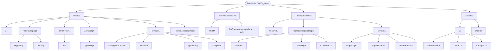

```mermaid
flowchart TD
        QA(["JavaScript QA Engineer"])
        C["Общее"]
        API["Тестирование API"]
        UI["Тестирование UI"]
        DEVOPS["DevOps"]
        ENV["Рабочая среда"]
        UNIT["Юнит-тесты"]
        F["Тестовый фреймворк"]

        QA --> C
        QA --> API
        QA --> UI
        QA --> DEVOPS

        C --> GIT
        C --> ENV
        C --> UNIT
        C --> JS[JavaScript] --> TypeScript
        C --> Patterns["Паттерны"]
        C --> F

        ENV --> Редактор
        ENV --> Линтер

        UNIT --> Jest

        Patterns --> AAA["Arrange Act Assert"]
        Patterns --> Адаптер
        Patterns --> Декоратор
        Patterns --> Фабрика


        API --> HTTP
        API --> Library["Библиотеки для работы с API"]

        DEVOPS --> CI
        DEVOPS --> Docker

        CI --> GA[Github action]
        CI --> GI[Gitlab CI]
        CI --> Артефакты

        UI --> Локаторы
        UI --> FUI["Тестовые фреймворки"]
        UI --> UIP["Паттерны"]
        
        FUI --> Cypress
        FUI --> Playwright
        FUI --> CodeceptJS
        
        UIP --> POM["Page Object"]
        UIP --> PEM["Page Element"]
        UIP --> Step["Step action"]
        UIP --> Step["Action Function"]
```