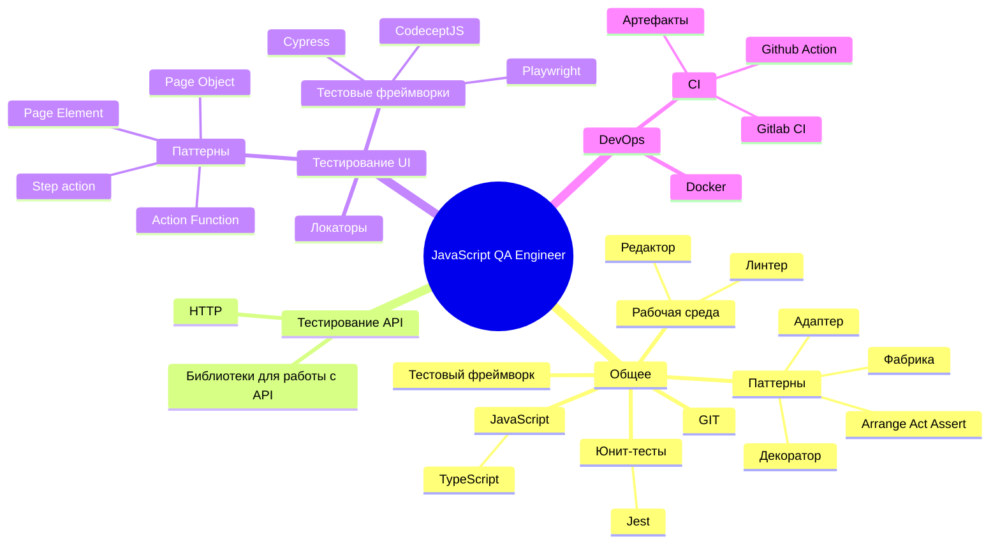

`mindmap` сгенерирован на основе файла [./other/competence_map.md](../competence_map.md)

```mermaid
mindmap
  root((JavaScript QA Engineer))
    Общее
      GIT
      Рабочая среда
        Редактор
        Линтер
      Юнит-тесты
        Jest
      JavaScript
        TypeScript
      Паттерны
        Arrange Act Assert
        Адаптер
        Декоратор
        Фабрика
      Тестовый фреймворк
    Тестирование API
      HTTP
      Библиотеки для работы с API
    Тестирование UI
      Локаторы
      Тестовые фреймворки
        Cypress
        Playwright
        CodeceptJS
      Паттерны
        Page Object
        Page Element
        Step action
        Action Function
    DevOps
      CI
        Github Action
        Gitlab CI
        Артефакты
      Docker

```